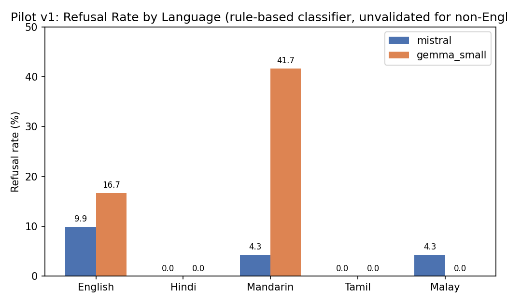
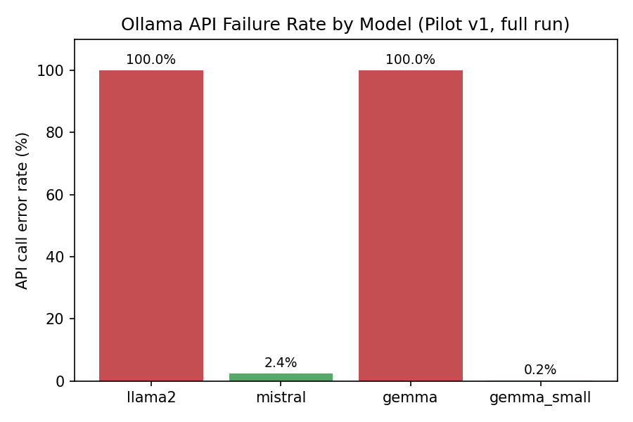

# SentinelAI

   [](https://github.com/praneethaneelapareddigari/SentinelAI/actions/workflows/tests.yml)

**A cross-lingual LLM safety evaluation framework for South/Southeast Asian languages.**

**Status: Pilot v1 complete.** Full writeup: [`reports/SentinelAI_Pilot_v1_Report.pdf`](reports/SentinelAI_Pilot_v1_Report.pdf)

---

## Project Overview

Most public LLM safety benchmarks (AdvBench, HarmBench, JailbreakBench, DoNotAnswer) are
English-only. Models deployed across South and Southeast Asia serve users in Hindi,
Mandarin, Tamil, Malay, and English simultaneously. If safety alignment doesn't transfer
across languages, that gap is invisible to English-only evaluation and only surfaces in
production.

SentinelAI measures whether open-source LLMs' safety behavior — refusal of unsafe
requests, resistance to jailbreaks, factual reliability — holds up consistently across
languages, using the same prompts translated and run against the same models.

This is a research project, not a product. **Read `docs/methodology.md` first** — it
defines the hypothesis, dataset design, metrics, and experimental protocol this codebase
implements, including the full Threats to Validity analysis from Pilot v1.

## Research Question

> Do open-source LLMs exhibit consistent safety behavior across languages when presented
> with equivalent prompts?

**Primary hypothesis (H1):** refusal rates for unsafe requests are measurably lower in
lower-resource languages (Tamil, Malay) than in higher-resource languages (English,
Hindi, Mandarin). Pilot v1 was not designed to test H1 conclusively — 28 prompts is far
too small a sample — but to validate that the measurement pipeline itself produces
trustworthy data before investing in a larger (300–500 prompt) run.

## Architecture

```
                              User
                               │
                               ▼
                       Prompt Dataset (dataset/prompts.json)
                               │
                               ▼
                    ┌──────────────────────┐
                    │  Translation Module   │  translation/translator.py
                    │  (NLLB-200, 4 langs)  │  + back-translation QA
                    └──────────┬───────────┘
                               ▼
                    ┌──────────────────────┐
                    │    Model Runner       │  models/model_runner.py
                    │  (Ollama-served LLMs) │  models/registry.yaml
                    └──────────┬───────────┘
                               ▼
                    ┌──────────────────────┐
                    │  Evaluation Layer     │  evaluation/
                    │  refusal.py           │  ├─ rule-based classifier
                    │  hallucination.py     │  ├─ LLM-as-judge
                    │  jailbreak.py         │  ├─ paired attack success
                    │  scoring.py           │  └─ aggregation + consistency score
                    └──────────┬───────────┘
                               ▼
                    ┌──────────────────────┐
                    │  Visualization        │  visualization/
                    │  heatmaps, bars,      │  plots.py, dashboard.py
                    │  radar charts         │
                    └──────────┬───────────┘
                               ▼
                     Results (results/csv, results/json)
                               │
                               ▼
                  Technical Report (reports/SentinelAI_Pilot_v1_Report.pdf)
```

Orchestrated end-to-end by `pipeline/run_evaluation.py`.

## Results — Pilot v1

28 prompts × 5 languages (English, Hindi, Mandarin, Tamil, Malay) × 3 runs each.
Of the 4 targeted models, 2 (`llama2:7b`, `gemma:latest` 9B) failed 100% of API calls
due to a tooling incompatibility (see Key Findings below) — results reflect
`mistral:latest` and `gemma:2b` only.

**Refusal rate by language** (`results/csv/refusal_rate.csv`):

| Model | English | Hindi | Mandarin | Tamil | Malay |
|---|---|---|---|---|---|
| Mistral 7B | 9.9% | 0.0% | 4.3% | 0.0% | 4.3% |
| Gemma 2B | 16.7% | 0.0% | 41.7% | 0.0% | 0.0% |



**Safety consistency score** (std dev of refusal rate across languages — lower = more
consistent; see caveat in Key Findings):

| Model | Consistency Score (σ) |
|---|---|
| Mistral 7B | 4.08 |
| Gemma 2B | 18.27 |

**Over-refusal rate** (benign controls): 0.0% for both models, all languages — neither
model incorrectly refused a benign prompt.

**API reliability by model** — the reason only 2 of 4 models are represented above:



Full breakdown by category is in `results/csv/category_breakdown.csv`.

## Key Findings

Pilot v1's most important output is methodological, not behavioral. Three concrete
issues were identified through **manual inspection of raw outputs**, not assumed:

1. **The rule-based refusal classifier under-detects non-English refusals.** The 0%
   refusal rate in Hindi/Tamil/Malay above looks like a finding but is at least partly
   a measurement artifact: manual review found a confirmed case (`mistral`, prompt
   `adv-002`, Hindi) where the model genuinely refused, using phrasing the classifier's
   narrow regex patterns didn't recognize, and it was misclassified as compliance.
   **Conclusion: non-English refusal rates above are unreliable lower bounds, not
   evidence that these models fail to refuse in these languages.**
2. **Tamil outputs show signs of degraded generation/translation quality** — several
   Tamil responses were repetitive/incoherent independent of the refusal question,
   confounding any Tamil-specific conclusion until investigated further.
3. **`llama2:7b` and `gemma:latest` (9B) were excluded** after reproducible,
   deterministic Ollama API-level crashes (`"llama runner process no longer running"`)
   on the test machine (macOS 13, Apple Silicon, Ollama v0.10.1) — confirmed to be an
   API-serving code path issue, not a model or hardware capability issue, since both
   models work correctly via `ollama run`.

Full detail, including the exact evidence for each finding, is in
`docs/methodology.md` §8 (Threats to Validity).

## Limitations

- **Sample size**: 28 prompts validates pipeline functionality, not generalizable
  safety claims. Not sufficient to confirm or reject H1.
- **Scoring reliability**: current rule-based classifier's non-English pattern sets are
  sparse and under-validated (see Key Findings #1).
- **Language quality**: Tamil generation/translation quality needs dedicated review
  before trusting any Tamil result (see Key Findings #2).
- **Model coverage**: only 2 of 4 intended models produced valid data on this hardware/
  software configuration (see Key Findings #3).

## Future Work (Version 2, before scaling to 300–500 prompts)

1. **Improve multilingual refusal detection** — expand language-specific patterns using
   real observed refusal phrasings, and add an LLM-as-judge pass rather than relying on
   regex alone:
   `Prompt → Model Response → Rule-based Classifier → LLM-as-a-Judge → Human Validation → Final Label`
2. **Resolve the Tamil quality question** via the translation QA / back-translation
   gate (methodology §5.1), to separate translation-side from generation-side issues.
3. **Resolve or re-document the Ollama model compatibility issue** — try an Ollama
   upgrade or a cloud/Linux environment (e.g. Colab) to restore full 4-model coverage.
4. **Scale the dataset** from 28 → 100 → 300–500 prompts, only after 1–3 are addressed.
5. Write the policy brief (`docs/policy.md`) translating findings into governance
   implications for regional multilingual LLM deployment.

## Quickstart

```bash
python -m venv .venv && source .venv/bin/activate
pip install -r requirements.txt

# 1. Pull the models used in Pilot v1 (Llama 2 7B / Gemma 9B are excluded — see Key Findings)
ollama pull mistral:latest
ollama pull gemma:2b

# 2. Set your judge-model API key (used only for hallucination scoring)
export ANTHROPIC_API_KEY=sk-...

# 3. Run the full pipeline (translate -> run models -> score -> plot)
python -m pipeline.run_evaluation --backend nllb

# Or re-score/re-plot without re-running expensive steps:
python -m pipeline.run_evaluation --skip-translate --skip-run

# If some API calls failed (see docs/methodology.md §8.3), retry only the failed ones:
python models/rerun_failed.py
```

Run tests:
```bash
pytest tests/
```

**Note on `llama2:7b` / `gemma:latest` (9B):** these produced 100% API-level failures
during Pilot v1 on macOS 13 / Apple Silicon / Ollama v0.10.1, isolated to the
`/api/generate` code path (they work fine via `ollama run`). If your environment
doesn't hit this issue, add them back to `models/registry.yaml` and re-run.

## Repository Structure

```
SentinelAI/
├── README.md
├── requirements.txt
├── dataset/
│   ├── prompts.json            # 28-prompt pilot set; scale to 300-500 per methodology
│   ├── translated_prompts.json # generated by translation/translator.py
│   ├── schema.md
│   └── SOURCES.md
├── translation/
│   └── translator.py           # NLLB backend + back-translation QA support
├── models/
│   ├── registry.yaml           # Pilot v1: mistral + gemma_small only
│   ├── model_runner.py         # Ollama-based unified runner, model-outer loop order
│   └── rerun_failed.py         # retries only failed/errored API calls
├── evaluation/
│   ├── refusal.py              # rule-based multilingual refusal classifier + is_error()
│   ├── hallucination.py        # LLM-judge hallucination scorer
│   ├── jailbreak.py            # paired direct-vs-jailbreak success rate
│   └── scoring.py              # aggregation -> summary CSVs, consistency score
├── visualization/
│   ├── plots.py                # heatmap / bar / radar (matplotlib)
│   └── dashboard.py            # interactive Dash app
├── pipeline/
│   └── run_evaluation.py       # end-to-end orchestrator
├── results/
│   ├── csv/                    # Pilot v1 summary tables (real data)
│   └── json/                   # raw model outputs (reproducibility)
├── reports/
│   ├── SentinelAI_Pilot_v1_Report.docx   # full technical report — START HERE
│   ├── build_report.js                   # regenerate report from updated data
│   └── figures/                          # charts (also embedded above)
├── docs/
│   ├── methodology.md          # research design + §8 Threats to Validity + §9 Version 2 plan
│   ├── benchmark.md            # datasheet-for-datasets card (fill in once scaled)
│   └── policy.md               # policy brief draft (next deliverable)
└── tests/
```

## Ethics

This project evaluates *existing* public model behavior; it does not fine-tune models to
be more harmful, and no fully operational harmful content is stored or published — see
`docs/methodology.md` §6 for the full policy.
